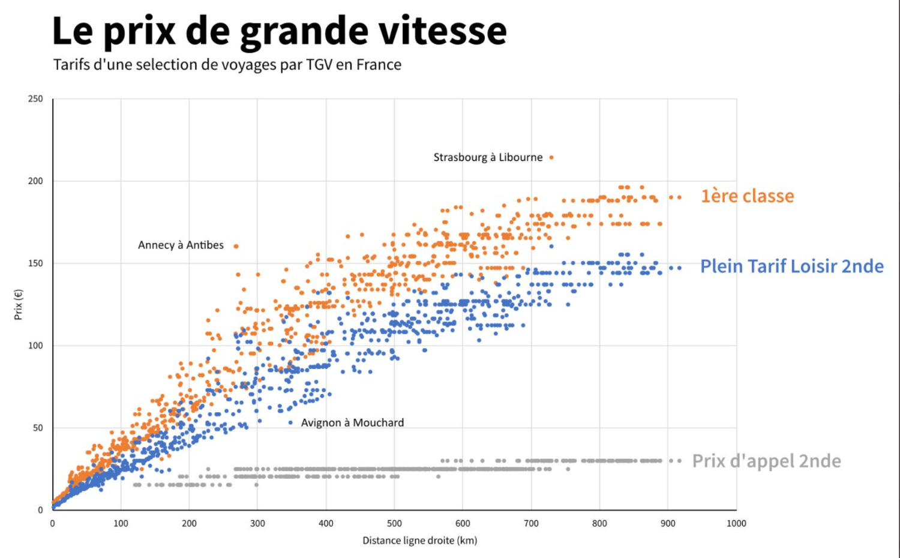

# A few experiments

## Le prix de grande vitesse

Experimenting with SNCF's [Open Data](https://ressources.data.sncf.com/explore/?sort=modified), to reproduce a scatterplot of TGV fares vs distance:

## Twitter followers

### Do my daily walk lengths follow a normal distribution?

